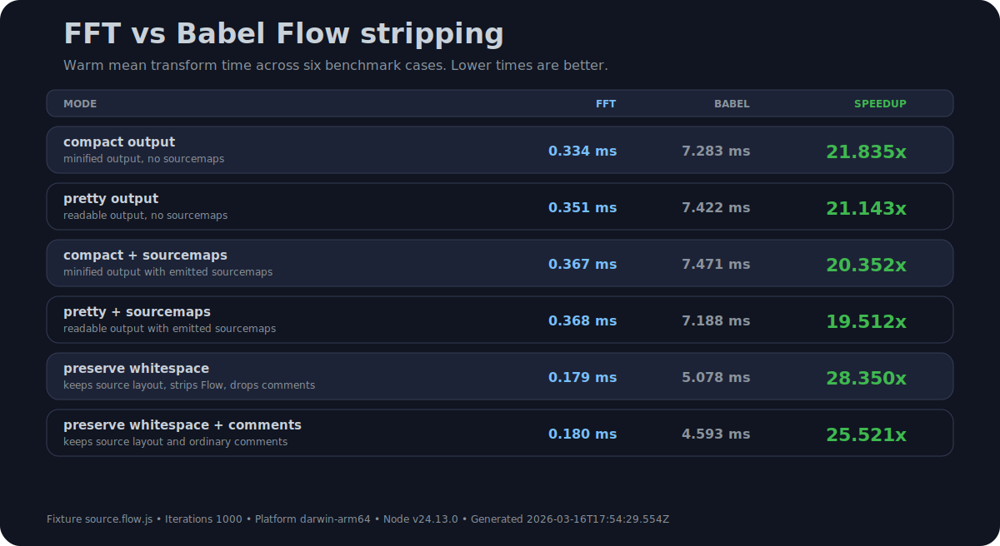

<p align="center">
  
</p>

# fast-flow-transform

Fast Flow-to-JavaScript transforms for bundlers, build pipelines, and one-shot
source conversion.

`fast-flow-transform` (`fft`) strips Flow syntax with a native Hermes-backed
pipeline, keeps JSX in place for your existing JSX toolchain, and ships
adapters for webpack, rspack, rsbuild, Parcel, Vite, Rollup, Rolldown, and
esbuild.

In the included FFT-vs-Babel benchmark, FFT delivers roughly 25x faster
transforms. See [Benchmark](#benchmark).

## Install

```bash
npm install --save-dev fast-flow-transform
```

Requires Node `>=18`.

## Pick Your Integration

Detailed adapter docs, option defaults, and additional config examples live in
[`packages/core/README.md`](./packages/core/README.md).

| Bundler  | Entry Point                    | Start Here                                                     |
| -------- | ------------------------------ | -------------------------------------------------------------- |
| webpack  | `fast-flow-transform/webpack`  | [`examples/webpack/README.md`](./examples/webpack/README.md)   |
| rspack   | `fast-flow-transform/rspack`   | [`examples/rspack/README.md`](./examples/rspack/README.md)     |
| rsbuild  | `fast-flow-transform/rsbuild`  | [`examples/rsbuild/README.md`](./examples/rsbuild/README.md)   |
| Parcel   | `fast-flow-transform/parcel`   | [`examples/parcel/README.md`](./examples/parcel/README.md)     |
| Vite     | `fast-flow-transform/vite`     | [`examples/vite/README.md`](./examples/vite/README.md)         |
| Rollup   | `fast-flow-transform/rollup`   | [`examples/rollup/README.md`](./examples/rollup/README.md)     |
| Rolldown | `fast-flow-transform/rolldown` | [`examples/rolldown/README.md`](./examples/rolldown/README.md) |
| esbuild  | `fast-flow-transform/esbuild`  | [`examples/esbuild/README.md`](./examples/esbuild/README.md)   |

Parcel usually wires FFT through a tiny local wrapper that re-exports
`fast-flow-transform/parcel`. The runnable example shows the exact shape.

## Programmatic API

```ts
import transform from 'fast-flow-transform';

const result = await transform({
	filename: '/abs/path/input.js',
	source: 'const answer: number = 42;',
	sourcemap: true,
});

console.log(result.code);
```

Use this path when you want one-shot Flow stripping inside your own build tools,
scripts, or codemods.

## CLI

```bash
fast-flow-transform src/input.js \
  --out-file dist/output.js \
  --source-map-file dist/output.js.map
```

The CLI reads the input file, runs the same transform API exposed by the
package, writes transformed code to `--out-file`, and writes a source map when
requested.

## Benchmark



Generated from `bench/fixtures/single-file-flow-preserve.js` with the README
benchmark workflow. The chart uses 1000 warm iterations per case and reports
warm `meanMs` only. The SVG footer and JSON record the exact platform, Node
version, and generation timestamp. Raw timings and cold-start measurements live
in
[`assets/readme-benchmark.json`](./assets/readme-benchmark.json).

## Examples And Docs

- Runnable bundler examples: [`examples/README.md`](./examples/README.md)
- Detailed package docs and adapter snippets:
  [`packages/core/README.md`](./packages/core/README.md)
- Contributor and release workflows: [`CONTRIBUTING.md`](./CONTRIBUTING.md)

## Attribution And Licensing

- FFT builds on top of Hermes Juno:
  <https://github.com/facebook/hermes/tree/static_h/unsupported/juno>
- Vendored Hermes source lives in `hermes` as an upstream submodule.
- FFT's own MIT license lives in [`LICENSE`](./LICENSE).
- Hermes/Juno third-party license details live in
  [`THIRD_PARTY_LICENSES`](./THIRD_PARTY_LICENSES).
